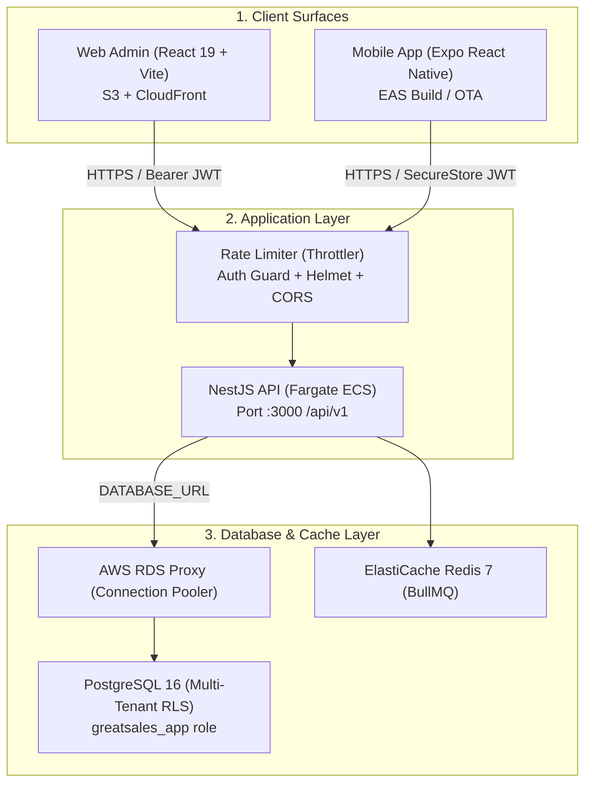

# GreatSales CRM — Dev to Staging Migration & Frontend Screen Audit Report

> **Comprehensive Technical Readiness Report**
> **Scope:** Full-Stack Audit (Frontend Web/Mobile, NestJS Backend, PostgreSQL Database & Multi-Tenant RLS)
> **Generated:** August 2026

---

## 📑 Table of Contents

1. [Executive Summary & Staging Topology](#1-executive-summary--staging-topology)
2. [Screen-by-Screen Frontend Deep Audit (13 Screens)](#2-screen-by-screen-frontend-deep-audit)
3. [Backend & API Readiness (NestJS)](#3-backend--api-readiness-nestjs)
4. [Database, Prisma & Multi-Tenancy (PostgreSQL)](#4-database-prisma--multi-tenancy-postgresql)
5. [UI/UX & Design System Hardening (Impeccable Standards)](#5-uiux--design-system-hardening)
6. [Prioritized Remediation Roadmap (P0 / P1 / P2)](#6-prioritized-remediation-roadmap)

---

## 1. Executive Summary & Staging Topology

Moving GreatSales from a local development environment to an isolated **AWS Staging Environment** requires transitioning from developer conveniences (hardcoded dev passwords, local in-memory Zustand mock stores, single-node Docker Postgres) to production-grade SaaS infrastructure.



### Key Differences Between Environments

| Concern | 🛠️ Local Development | 🧪 AWS Staging Environment |
|---|---|---|
| **Database Host** | `localhost:5433` (Docker Postgres 16) | AWS RDS PostgreSQL 16 Multi-AZ |
| **Connection Pooling** | Direct connection | AWS RDS Proxy (`DATABASE_URL`) |
| **Prisma Migrations** | Local `pnpm db:deploy` | CI/CD Deploy Stage via `DIRECT_URL` (Superuser) |
| **API CORS Origin** | `*` / `http://localhost:5174` | Restricted (`https://app-staging.greatsales.in`) |
| **Rate Limiting** | None | 10 requests / min on `/auth/*` (`@nestjs/throttler`) |
| **Error Details** | Stack traces enabled | Sanitized generic 500 error envelopes |
| **Web Demo Auto-fill** | Prefilled (`Passw0rd!`, `admin@acme.test`) | Disabled (Empty inputs) |
| **Mobile Token Store** | `AsyncStorage` / In-memory | `expo-secure-store` (Keychain / Keystore) |
| **Web Hosting** | Vite Local Dev Server (`:5174`) | AWS S3 Static Bucket + CloudFront CDN |
| **Cross-Tenant Test** | Manual check | Automated CI Blocker Test |

---

## 2. Screen-by-Screen Frontend Deep Audit

Our automated scan and manual inspection across all `apps/web/src` files revealed a critical architectural split: **6 screens are fully wired to real backend endpoints**, while **7 screens/components still rely on prototype in-memory Zustand mock data (`useTrackerStore`)**.

---

### Screen 1: 🔐 Authentication & Login
- **File:** [`apps/web/src/features/auth/LoginPage.tsx`](file:///c:/Users/Kannan/GreatSales/apps/web/src/features/auth/LoginPage.tsx)
- **Data Source:** Real API (`POST /auth/login`)

#### 🔴 Critical Flaws & Gaps
1. **Hardcoded Dev Password in Bundle (P0):** `DEMO_PASSWORD = "Passw0rd!"` and `DEMO_TENANT_ID = "tenant_acme"` are bundled and automatically fill the form inputs.
2. **Sales Web Role Rejection (P1):** When a salesperson attempts to log in on the web, `SalesWebLoginError` is thrown client-side *after* a successful token generation instead of showing a dedicated mobile app download QR / link.
3. **Disabled Super Admin Form (P1):** Super Admin tab has a disabled submit button without an explanation that the Platform Console is an independent operator surface.

#### 🛠️ Required Fixes
- Conditionally render demo prefill buttons only when `import.meta.env.DEV === true`.
- Implement password visibility toggles (`Eye` / `EyeOff` icons) and keyboard accessibility.

---

### Screen 2: 📈 Executive Dashboard
- **File:** [`apps/web/src/features/dashboard/DashboardPage.tsx`](file:///c:/Users/Kannan/GreatSales/apps/web/src/features/dashboard/DashboardPage.tsx)
- **Data Source:** Hybrid (`useProjections` API + Client-side `useLeads` page loop)

#### 🔴 Critical Flaws & Gaps
1. **Client-side N+1 Infinite Fetch Loop (P0):**
   ```ts
   // apps/web/src/features/dashboard/DashboardPage.tsx (Line 82-86)
   useEffect(() => {
     if (leadsQuery.hasNextPage && !leadsQuery.isFetchingNextPage) {
       leadsQuery.fetchNextPage();
     }
   }, [leadsQuery.hasNextPage, leadsQuery.isFetchingNextPage, leadsQuery.fetchNextPage]);
   ```
   In a staging/production database with thousands of leads, continuously fetching all paginated pages freezes the browser and floods the API.
2. **Disconnected Topbar Filters (P1):** Global Principal and Owner filters in the Topbar are not wired into the Dashboard query parameters.
3. **Derived Lookup Options (P2):** Salesperson and Industry dropdown options for "+ New Lead" are derived by deduplicating currently loaded lead rows rather than querying dedicated lookup master endpoints.

#### 🛠️ Required Fixes
- Create a backend aggregated endpoint `GET /api/v1/analytics/dashboard?period=YYYY-MM` to return pre-computed server KPIs in a single roundtrip.
- Wire Topbar filters into React Query keys.

---

### Screen 3: 📊 Monthly Projections Worksheet
- **File:** [`apps/web/src/features/projections/ProjectionsPage.tsx`](file:///c:/Users/Kannan/GreatSales/apps/web/src/features/projections/ProjectionsPage.tsx)
- **Data Source:** Real API (`GET /projections`, `PATCH /projections/:id`)

#### 🔴 Critical Flaws & Gaps
1. **Table Invalidation Flicker (P1):** On every inline cell edit, `qc.invalidateQueries({ queryKey: ["projections"] })` re-fetches the entire table, causing visible UI row flickering.
2. **Missing Tabular Numbers (P2):** Financial columns (Committed Qty, Achieved Qty, Value, Target Date) lack `tabular-nums` CSS, causing column widths to shift on number changes.
3. **Mobile Worksheet Overflow (P2):** On smaller viewports, horizontal scrolling loses the Customer Name reference without a sticky pinned column.

#### 🛠️ Required Fixes
- Implement Optimistic UI updates with rollback in `useUpdateProjection`.
- Apply `font-mono tabular-nums text-right` to all currency/quantity cells.
- Pin the Customer Name column with `sticky left-0 bg-surface z-10`.

---

### Screen 4: 🏢 Customers Directory & Drawer
- **Files:** [`apps/web/src/features/customers/CustomersPage.tsx`](file:///c:/Users/Kannan/GreatSales/apps/web/src/features/customers/CustomersPage.tsx), [`CustomerDrawer.tsx`](file:///c:/Users/Kannan/GreatSales/apps/web/src/features/customers/CustomerDrawer.tsx)
- **Data Source:** Real API (`GET /customers`, `POST /customers`, `PATCH /customers/:id`)

#### 🔴 Critical Flaws & Gaps
1. **Manual Input Validation (P1):** `AddCustomerModal.tsx` uses raw string checks rather than Zod validation schemas. GSTIN format (`22AAAAA0000A1Z5`) and 10-digit phone numbers are not validated prior to API submission.
2. **Orphaned Prototype Code (P1):** [`AddMappingModal.tsx`](file:///c:/Users/Kannan/GreatSales/apps/web/src/components/modals/AddMappingModal.tsx) still imports `useTrackerStore` and is unlinked from the main navigation.
3. **Drawer Sub-tab Flash (P2):** Asynchronously loaded tabs in `CustomerDrawer` lack skeleton loaders.

#### 🛠️ Required Fixes
- Standardize all modal forms with `react-hook-form` + `@hookform/resolvers/zod`.
- Clean up or rewire `AddMappingModal` to the backend products/mappings API.

---

### Screen 5: 🎯 Leads & Pipeline Kanban
- **File:** [`apps/web/src/features/leads/LeadsPage.tsx`](file:///c:/Users/Kannan/GreatSales/apps/web/src/features/leads/LeadsPage.tsx)
- **Data Source:** Real API (`useLeads`, `useCreateLead`, `useUpdateLead`)

#### 🔴 Critical Flaws & Gaps
1. **No Drag & Drop (P1):** Kanban columns display deal stages, but stages can only be changed via modal dropdowns rather than native drag-and-drop.
2. **Infinite Scroll Trigger (P2):** Rapid scrolling lacks a distinct "Loading more..." skeleton footer.

#### 🛠️ Required Fixes
- Add quick stage advancement action buttons (`Move to Next Stage`) directly on Kanban cards.
- Add infinite scroll loading indicators.

---

### Screen 6: 📦 Sales Orders & Fulfillment
- **Files:** [`apps/web/src/features/orders/OrdersPage.tsx`](file:///c:/Users/Kannan/GreatSales/apps/web/src/features/orders/OrdersPage.tsx), [`InvoicePrintModal.tsx`](file:///c:/Users/Kannan/GreatSales/apps/web/src/features/orders/InvoicePrintModal.tsx)
- **Data Source:** Real API (`useOrders`, `useCreateOrder`)

#### 🔴 Critical Flaws & Gaps
1. **Invoice Print CSS Leakage (P1):** [`InvoicePrintModal.tsx`](file:///c:/Users/Kannan/GreatSales/apps/web/src/features/orders/InvoicePrintModal.tsx) calls `window.print()` without scoped print media styles, causing sidebars and headers to print alongside the invoice.
2. **Status Transition Validation (P1):** Orders can skip stages (e.g., jump directly from `Created` to `Delivered`) without prompting for delivery partner or tracking references.

#### 🛠️ Required Fixes
- Add dedicated `@media print` rules in `index.css` to isolate printable invoices.
- Enforce sequential state transitions with step-by-step confirmation modals.

---

### Screen 7: 💳 Payments & Aging Invoices
- **Files:** [`apps/web/src/features/payments/PaymentsPage.tsx`](file:///c:/Users/Kannan/GreatSales/apps/web/src/features/payments/PaymentsPage.tsx), [`ImportPaymentsModal.tsx`](file:///c:/Users/Kannan/GreatSales/apps/web/src/features/payments/ImportPaymentsModal.tsx)
- **Data Source:** Real API (`usePayments`, `useCreatePayment`)

#### 🔴 Critical Flaws & Gaps
1. **Impeccable Antipattern (Warning):** [`ImportPaymentsModal.tsx` (Line 293)](file:///c:/Users/Kannan/GreatSales/apps/web/src/features/payments/ImportPaymentsModal.tsx#L293) uses `animate-bounce`, which is a dated/distracting animation pattern flagged by design audit tools.
2. **Timezone Bias in Aging Buckets (P1):** Invoice aging categories (0-30, 31-60, 61-90, 90+ days) calculate durations using local browser clocks rather than UTC server time.
3. **Sequential Bulk Mutations (P1):** Excel bulk uploads send individual row-by-row mutations instead of a single atomic batch payload.

#### 🛠️ Required Fixes
- Replace `animate-bounce` with subtle pulse animations.
- Connect Excel uploads to a transactional bulk endpoint (`POST /api/v1/payments/bulk`).

---

### Screen 8: 📅 Actionable Follow-ups Schedule
- **Files:** [`apps/web/src/features/followups/FollowUpsPage.tsx`](file:///c:/Users/Kannan/GreatSales/apps/web/src/features/followups/FollowUpsPage.tsx), [`FollowUpModal.tsx`](file:///c:/Users/Kannan/GreatSales/apps/web/src/features/followups/FollowUpModal.tsx)
- **Data Source:** Real API (`useFollowUps`, `useUpdateFollowUp`)

#### 🔴 Critical Flaws & Gaps
1. **Broken Follow-up Chain (P1):** Clicking `CheckCircle2` marks a follow-up complete without prompting for the *next* follow-up date and remark, breaking recurring CRM sales tracking.
2. **Static Filter Tabs (P2):** Filter headers ("Today", "Upcoming", "Overdue") lack dynamic count badges.

#### 🛠️ Required Fixes
- Introduce a 2-step completion modal ("Log Outcome & Schedule Next Follow-up").

---

### Screen 9: 📦 Products Catalog & Pricing Master
- **Files:** [`apps/web/src/features/products/ProductsPage.tsx`](file:///c:/Users/Kannan/GreatSales/apps/web/src/features/products/ProductsPage.tsx), [`AddProductModal.tsx`](file:///c:/Users/Kannan/GreatSales/apps/web/src/features/products/AddProductModal.tsx), [`AddPrincipalModal.tsx`](file:///c:/Users/Kannan/GreatSales/apps/web/src/features/products/AddPrincipalModal.tsx)
- **Data Source:** Hybrid (Products: Real API, Principals: Mock Store)

#### 🔴 Critical Flaws & Gaps
1. **AddPrincipal is 100% Mock (P0 Blocker):**
   ```ts
   // apps/web/src/features/products/AddPrincipalModal.tsx (Line 13 & 25)
   const { addPrincipal, principals } = useTrackerStore();
   addPrincipal(trimmed); // Mutates in-memory Zustand only — DB is never updated!
   ```
2. **Client-Generated Random SKU (P0 Blocker):**
   ```ts
   // apps/web/src/features/products/AddProductModal.tsx (Line 35)
   const generatedSku = `${(selectedPrincipal?.name || "PR").slice(0, 3).toUpperCase()}-${Math.floor(1000 + Math.random() * 9000)}`;
   ```
   Users cannot enter official SKU part numbers, and collisions can occur due to random 4-digit generation.

#### 🛠️ Required Fixes
- Create `POST /api/v1/principals` endpoint and rewire `AddPrincipalModal`.
- Add an explicit SKU input field with server-side unique constraint validation.

---

### Screen 10: 👥 Users & Team Governance
- **Files:** [`apps/web/src/features/users/UsersPage.tsx`](file:///c:/Users/Kannan/GreatSales/apps/web/src/features/users/UsersPage.tsx), [`EditUserModal.tsx`](file:///c:/Users/Kannan/GreatSales/apps/web/src/features/users/EditUserModal.tsx)
- **Data Source:** Real API (`useUsers`, `useUpdateUser`)

#### 🔴 Critical Flaws & Gaps
1. **Mock Owner ID Dependency (P0 Blocker):** `UsersPage.tsx` imports and uses `useMockOwnerId` from `@/lib/mockOwner` instead of reading the active session via `useAuthUser()`.
2. **Missing Invite User Flow (P1):** The UI only permits editing existing seeded users; inviting new team members is unimplemented in the web console.

#### 🛠️ Required Fixes
- Remove `@/lib/mockOwner` across all components and replace with authenticated user context.
- Implement `AddUserModal` calling `POST /api/v1/users`.

---

### Screen 11: 🗄️ Data Management & Backup
- **File:** [`apps/web/src/features/data/DataPage.tsx`](file:///c:/Users/Kannan/GreatSales/apps/web/src/features/data/DataPage.tsx)
- **Data Source:** ❌ **100% Mock Store (`useTrackerStore`)**

#### 🔴 Critical Flaws & Gaps
1. **Misleading Demo Reset Buttons (P0 Blocker):** "Reset to Sample Data" and "Clear All Data" wipe local Zustand memory and have no effect on PostgreSQL.
2. **Prototype Debug Artifact (P0 Blocker):** This entire screen is an early prototype debugging screen.

#### 🛠️ Required Fixes
- Hide this screen from staging/production navigation (`import.meta.env.DEV` only), or replace with real CSV export and system audit log viewers.

---

### Screen 12: 🏢 Super Admin / Management Portal
- **Files:** [`apps/web/src/features/management/ManagementHomePage.tsx`](file:///c:/Users/Kannan/GreatSales/apps/web/src/features/management/ManagementHomePage.tsx), [`ManagementSwitcher.tsx`](file:///c:/Users/Kannan/GreatSales/apps/web/src/features/management/ManagementSwitcher.tsx)
- **Data Source:** ❌ **100% Mock Store (`useManagementStore` + `useTrackerStore`)**

#### 🔴 Critical Flaws & Gaps
1. **Single-Tenant Backend vs Multi-Tenant Switcher (P0 Blocker):** The switcher modifies local UI state, while the backend JWT session is strictly bound to a single `tenant_id`.
2. **Phase 2 Operator Screen in Phase 1 (P1):** Cross-tenant aggregation is a SaaS operator capability (Phase 2). Showing mock company switches in staging causes confusion.

#### 🛠️ Required Fixes
- Route tenant admins directly to `/dashboard` upon login.
- Gate multi-company switcher access to users with the `platform_super_admin` role.

---

### Screen 13: 🧭 App Shell, Topbar & Command Palette
- **Files:** [`apps/web/src/components/layout.tsx`](file:///c:/Users/Kannan/GreatSales/apps/web/src/components/layout.tsx), [`CommandPaletteModal.tsx`](file:///c:/Users/Kannan/GreatSales/apps/web/src/components/CommandPaletteModal.tsx)
- **Data Source:** ❌ **Mock Store (`useTrackerStore`) for Notification Counts & Search**

#### 🔴 Critical Flaws & Gaps
1. **Stale Mock Notification Badges (P0 Blocker):** Overdue follow-up counts and Red Zone alerts in the sidebar and topbar bell icon query `useTrackerStore`, meaning badge numbers never change when database records are updated!
2. **Mock Command Palette (P0 Blocker):** Cmd+K searches static in-memory seed data; newly created live customers or orders cannot be found.
3. **Missing Staging Environment Indicator (P1):** No environment banner exists to warn testers that they are operating in staging.

#### 🛠️ Required Fixes
- Connect notification counts to React Query cached queries (`useFollowUps`, `usePayments`).
- Add a sticky amber `[STAGING ENVIRONMENT — TEST DATA]` header banner.
- Update Command Palette to navigate routes and search cached entity lists.

---

## 3. Backend & API Readiness (NestJS)

```
┌──────────────────────────────────────────────────────────────────────────┐
│                           NestJS API Hardening                           │
│                                                                          │
│  [Requests] ──> [Helmet + Strict CORS] ──> [Throttler (10 req/min)]      │
│                     │                                                    │
│                     ▼                                                    │
│             [JWT Auth Guard] ──> [Tenant Context Extraction (tenantId)]  │
│                     │                                                    │
│                     ▼                                                    │
│             [PrismaService.forTenant] ──> [RLS: SET app.tenant_id]       │
└──────────────────────────────────────────────────────────────────────────┘
```

### Critical Backend Tasks Before Staging:

1. **Strict CORS Lockdown (`apps/api/src/main.ts`):**
   - Disallow wildcard origins when credentials are enabled. Configure `CORS_ORIGIN="https://app-staging.greatsales.in"`.
2. **Environment Variable Validation (`apps/api/src/config/env.ts`):**
   - Ensure all secrets (`JWT_ACCESS_SECRET`, `JWT_REFRESH_SECRET`) meet minimum entropy requirements (min 32 chars) and are provisioned via AWS Secrets Manager.
3. **Exception Filter Sanitization (`apps/api/src/common/all-exceptions.filter.ts`):**
   - Change `if (process.env.NODE_ENV !== 'production')` to `if (process.env.NODE_ENV === 'development')` to ensure database errors and stack traces are hidden in staging (`NODE_ENV=staging`).
4. **Rate Limiting / Brute-Force Guard:**
   - Install and configure `@nestjs/throttler` in `app.module.ts` targeting `/api/v1/auth/login` and `/api/v1/auth/refresh`.
5. **ALB Health Probe Route:**
   - Add a root `/health` controller outside the `/api/v1` global prefix for AWS Application Load Balancer health checks.

---

## 4. Database, Prisma & Multi-Tenancy (PostgreSQL)

### 1. Separation of Database Roles
- **Migration & Deploy Pipeline:** Runs exclusively via `DIRECT_URL` connecting as superuser `greatsales` to apply schema changes and RLS policies (`pnpm --filter @greatsales/db db:deploy`).
- **Application Runtime:** Connects exclusively via `DATABASE_URL` as non-superuser `greatsales_app`. Every query must invoke `SELECT set_config('app.tenant_id', $tenantId, true)` to enforce row-level isolation.
- `PrismaService` includes a fail-closed check that refuses to start if it detects a superuser connection.

### 2. Staging Seed Data Policy
- **Never use dev passwords in staging:** Replace the shared dev password `Passw0rd!` with unique, secure credentials for synthetic staging tenants (e.g., `Acme Staging`, `Globex Staging`).

### 3. Automated Cross-Tenant Isolation Tests (CI Blocker)
- Add an automated integration test in CI that logs in as `Tenant A` and verifies that attempts to query `Tenant B` records return 0 rows or 403 Forbidden.

---

## 5. UI/UX & Design System Hardening

Based on **Impeccable** and **UI/UX Pro Max** guidelines, the following visual and interaction standards must be enforced:

1. **Financial Data Density & Alignment:**
   - All monetary amounts (INR) and quantities must use `tabular-nums font-mono text-right`.
2. **Animation Refinement:**
   - Remove bounce/elastic easing (`animate-bounce` in `ImportPaymentsModal.tsx`). Use smooth exponential curves (`transition-all duration-200 ease-out`).
3. **Empty & Error State Resilience:**
   - Every data table and Kanban column must display a structured empty state containing an icon, title, description, and primary CTA when zero items are returned.
4. **Touch Target Compliance:**
   - Ensure all buttons, icon triggers, and form selects have a minimum bounding box of $44 \times 44\text{ px}$ for mobile and tablet touch usability.

---

## 6. Prioritized Remediation Roadmap

### 🚨 Phase 1: P0 Launch Blockers (Must Fix Immediately)

| Component | Target File | Action Required |
|---|---|---|
| **Auth** | `apps/web/src/features/auth/LoginPage.tsx` | Remove hardcoded `Passw0rd!` prefill in non-dev modes |
| **Catalog** | `apps/web/src/features/products/AddPrincipalModal.tsx` | Rewire from mock `useTrackerStore` to `POST /api/v1/principals` |
| **Catalog** | `apps/web/src/features/products/AddProductModal.tsx` | Replace `Math.random()` with user SKU input field |
| **App Shell** | `apps/web/src/components/layout.tsx` | Rewire sidebar/topbar notification badges from mock to React Query cache |
| **Users** | `apps/web/src/features/users/UsersPage.tsx` | Eliminate `useMockOwnerId` import; use `useAuthUser()` |
| **Data Page** | `apps/web/src/features/data/DataPage.tsx` | Hide mock reset page from staging navigation |
| **Dashboard** | `apps/web/src/features/dashboard/DashboardPage.tsx` | Replace client-side infinite fetch loop with server aggregation |

### ⚠️ Phase 2: P1 High Priority (Before Staging QA)

| Component | Target File | Action Required |
|---|---|---|
| **Security** | `apps/api/src/main.ts` | Lock down CORS origins to staging domain |
| **Security** | `apps/api/src/common/all-exceptions.filter.ts` | Prevent stack trace leakage in staging |
| **Security** | `apps/api/src/app.module.ts` | Implement `@nestjs/throttler` rate limiting |
| **Orders** | `apps/web/src/features/orders/InvoicePrintModal.tsx` | Add `@media print` styles for clean invoice printing |
| **Payments** | `apps/web/src/features/payments/ImportPaymentsModal.tsx` | Remove `animate-bounce` and connect batch upload endpoint |
| **Command Palette** | `apps/web/src/components/CommandPaletteModal.tsx` | Connect search to live cached query data |
| **Environment** | `apps/web/src/components/layout.tsx` | Add `[STAGING ENVIRONMENT]` indicator banner |

### 🎨 Phase 3: P2 Polish & Scale (Before Production Release)

- Implement Optimistic UI updates on the Projections Worksheet.
- Add Drag-and-Drop functionality to the Leads Kanban Board.
- Connect mobile token storage to `expo-secure-store`.
- Integrate Sentry for frontend and backend error tracking.
